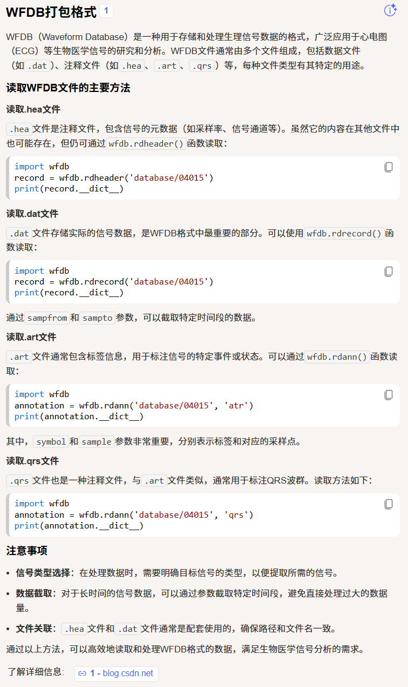

fetal-ecg-synthetic-database-1.0.0/generate_dataset.py: 组织这个数据集成下面这样的结构，用以网络的使用(Organize the data in the folder structure (fecg_ground,mixture,mecg_ground) for the network.) 

init.py: 训练网络的选项列表(List of options used to train the network.) 

networks.py: 网络在模拟出来的数据集上测试的代码(The W-NETR architecture for FECG extraction testing on simulation dataset.)
networks_real.py: 网络在真实的数据集上测试的代码(The W-NETR architecture for FECG extraction testing on real dataset.)

test_simulation.py: (Runs the testing on simulation dataset.)
test_real.py: Runs the testing on real dataset.

1.调用关系理解（根目录下的代码文件）：
test.py,test_pcdb.py,test_real.py是最顶层的逻辑设计，它们是用了init.py,networks_real.py,networks.py模块

networks.py,networks_real.py是网络模型的设计，它们调用了init.py模块

init.py是训练网络的选项列表，是最基础的实现吧

2.调用关系理解（每个数据集（ADFECGDB、PCDB、fetal-ecg-synthetic-database-1.0.0）文件夹下的代码文件）：()
它们相对于根目录下的脚本是独立的自称体系的，主要目的只是为了处理数据集

3.调用关系理解（models目录下的文件：dynunet_block.py、PatchEmbeddingBlock.py、unetr_block.py、unetr_real.py、unetr.py、vit.py）：

4.调用关系理解（util目录下的文件：dataset_pcdb.py(验证集处理)、dataset_real.py(训练集处理)、dataset.py(训练集处理)）：这三个文件基本几乎一模一样，只有两三行的代码不同或者多少（应该只是因为不同数据集之间微小的差异导致的差距，所以总的来说算是一份代码，是同一个逻辑）

WFDB格式介绍

这篇论文的三个数据集都是胎儿心电图（FECG）研究领域常用的公开数据库，下面为详细介绍：

1. ADFECGDB（腹部与直接胎儿心电数据库）

核心信息：真实临床数据，包含同步采集的腹部和直接胎儿心电信号。

• 数据来源：波兰西里西亚医科大学妇产科，5名孕38-41周临产孕妇网页

• 采集方式：4个腹部电极 + 胎儿头皮直接心电图电极同步记录

• 数据格式：EDF/EDF+格式，包含直接/间接FECG信号及R波位置参考标记

• 技术规格：采样率1kHz，带宽1-150Hz，16位分辨率

• 主要用途：开发和测试新的FECG处理算法，如抑制母体心电图干扰、检测胎儿QRS复合体

• 获取地址：PhysioNet平台（https://physionet.org/content/adfecgdb/）

2. PCDB（PhysioNet/Computing in Cardiology Challenge 2013 Set-A）

核心信息：2013年心脏病学计算挑战赛公开数据集，专注于非侵入性胎儿心电信号。

• 数据内容：75组持续1分钟的孕妇腹部心电图记录，每组4个通道网页

• 技术规格：采样率1kHz，提供胎儿QRS（FQRS）参考位置注释

• 挑战背景：PhysioNet/Computing in Cardiology Challenge 2013竞赛数据集

• 主要用途：评估胎儿心电信号提取算法的性能，常用于机器学习模型测试

• 获取地址：PhysioNet平台（https://physionet.org/content/challenge-2013/）

注意：PCDB缩写在其他领域有不同含义（如植物基因编辑数据库、药效团数据库），但在FECG领域特指此数据集。

3. Fetal-ECG-Synthetic-Database-1.0.0（FECGSYNDB）

核心信息：大规模合成数据库，使用FECGSYN模拟器生成。

• 生成方式：FECGSYN模拟器，将母体和胎儿心脏建模为点偶极子

• 数据规模：10种模拟妊娠 × 7种生理事件 × 5个噪声水平 × 5次重复 = 1750个合成信号

• 持续时间：总计145.8小时多通道数据，包含110万个胎儿峰值

• 技术规格：每个信号5分钟，采样率250Hz，16位分辨率，34个通道（32个腹部+2个母体参考）

• 模拟场景：包括基线、胎儿运动、心率加速/减速、子宫收缩、异位搏动、双胎妊娠等生理事件

• 主要用途：为算法开发提供可控、可重复的测试环境，特别适合压力测试和鲁棒性评估

数据集关系与应用场景

这三个数据集在研究中常被结合使用：

数据集类型 数据特点 典型应用

ADFECGDB 真实临床数据，含金标准参考 算法最终验证、性能基准测试

PCDB 真实数据，标准化挑战数据集 算法横向比较、竞赛评估

FECGSYNDB 合成数据，规模大、场景丰富 算法开发、参数调优、鲁棒性测试

在实际研究中，通常使用FECGSYNDB进行算法开发和初步验证，然后用PCDB和ADFECGDB进行真实数据测试和性能评估。这种组合既能利用合成数据的大规模优势，又能确保算法在真实临床场景中的有效性。